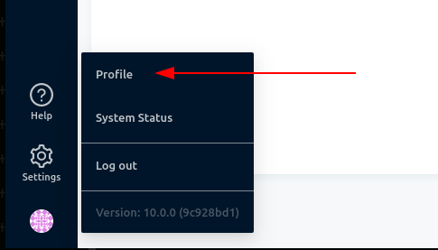
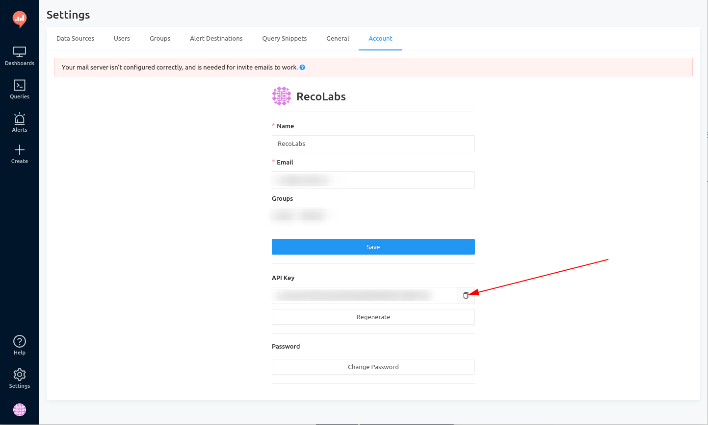

# Redash Go SDK

[](https://github.com/RecoLabs/redash-go-sdk/releases)
[](https://github.com/RecoLabs/redash-go-sdk/actions/workflows/lintest.yml)
[](https://app.codecov.io/gh/RecoLabs/redash-go-sdk)
[](https://pkg.go.dev/github.com/recolabs/redash-go-sdk)
[](https://sourcegraph.com/github.com/RecoLabs/redash-go-sdk?badge)


An SDK for the programmatic management of Redash. The main
component of the SDK is a **client**, which is a go wrapper of
Redash's REST API.

- [Redash Go SDK](#redash-go-sdk)
  - [Usage](#usage)
    - [Installation](#installation)
    - [Client Initialization](#client-initialization)
      - [How to find your API key](#how-to-find-your-api-key)
      - [How to initialize the client](#how-to-initialize-the-client)
    - [Queries](#queries)
      - [List Queries](#list-queries)
      - [Get Query](#get-query)
      - [Add Query](#add-query)
      - [Archive Query](#archive-query)
      - [Regenerate Query API token](#regenerate-query-api-token)
    - [DataSources](#datasources)
      - [List DataSource](#list-datasource)
      - [Get DataSource](#get-datasource)
      - [Add DataSource](#add-datasource)
      - [Delete DataSource](#delete-datasource)
    - [Visualizations](#visualizations)
      - [Get a Visualization's URL](#get-a-visualizations-url)
      - [Add Visualization](#add-visualization)
      - [Delete Visualization](#delete-visualization)
    - [Users](#users)
      - [Get User](#get-user)
    - [Supported versions](#supported-versions)
  - [What's included?](#whats-included)
    - [Which parts of the API are covered?](#which-parts-of-the-api-are-covered)
  - [Development](#development)
    - [Generating code](#generating-code)
    - [Generating Tests](#generating-tests)
      - [Generating Test Templates](#generating-test-templates)
      - [Generating mocks](#generating-mocks)
    - [View documentation](#view-documentation)
    - [Linting](#linting)
    - [Testing](#testing)
  - [Why](#why)

## Usage

### Installation

- [ ] TODO add go get instructions

### Client Initialization

To initialize the client, you need to know your API key and your Redash address.
The Redash address is your server address without protocol and trailing slash `/`. For example, if your server is on `https://localhost:5000/` then you need `localhost:5000` as your host.

#### How to find your API key

After logging in to your Redash instance, go to the
profile page:



And then, you can copy your API key in the "Account" tab:



> Based on [this documentation page](https://redash.io/help/user-guide/integrations-and-api/api).

#### How to initialize the client

```golang
import (
    "fmt"

    redashclient "github.com/recolabs/redash-go-sdk"
    "github.com/recolabs/redash-go-sdk/gen/client"
)

func main() {
    redashClient := redashclient.NewClient(
        "{{.API_KEY}}",
        &client.TransportConfig{
            Host: "{{.HOST_ADDRESS}}",
        })

    // This part is just an example, not required.
    err := redashClient.Administration.Ping()
    if err == nil {
        fmt.Println("Client successfully initialized! Happy Redash-ing.")
    }
}
```

### Queries

#### List Queries

```golang
queries, err := redashClient.Queries.List()
```

#### Get Query

```golang
queryID := 1
queries, err := redashClient.Queries.Get(1)
```

#### Add Query

```golang
queryStr := "SELECT * FROM postgres.public.table"
queryName := "swagger query"
queryOptions = `{
        "parameters": []
}`
query, err := queries.NewQuery(queryName, queryOptions, queryStr, 1)
if err != nil {
    fmt.Printf("%v\n", err)
}
responseQuery, err := redashClient.Queries.Add(query)
```

#### Archive Query

```golang
queryID := 1
err := redashClient.Queries.Archive(1)
```

#### Regenerate Query API token

```golang
queryID := 1
err := redashClient.Queries.RegenerateQueryAPIKey(1)
```

### DataSources

#### List DataSource

```golang
dataSources, err := redashClient.DataSources.List()
```

#### Get DataSource

```golang
dsID := 1
queries, err := redashClient.DataSources.Get(dsID)
```

#### Add DataSource

```golang
import redashclient "github.com/recolabs/redash-go-sdk/datasources"

...

dataSourceType := "pg"
dataSourceName := "test"
postgresqlOptions := `{
    "dbname": "aa",
        "host": "1.1.1.1",
        "port": 5432
}`

ds, err := datasources.NewDataSource(dataSourceType,dataSourceName, postgresqlOptions)
if err != nil {
fmt.Printf("%v\n", err)
}
responseQuery, err := redashClient.Queries.Add(ds)
```

#### Delete DataSource

```golang
queryID := 1
err := redashClient.DataSources.Delete(queryID)
```

#### Update DataSource

```golang
import redashclient "github.com/recolabs/redash-go-sdk/datasources"

...

dataSourceType := "pg"
dataSourceName := "test"
postgresqlOptions := `{
    "dbname": "aa",
        "host": "1.1.1.1",
        "port": 5432
}`

ds, err := datasources.NewDataSource(dataSourceType,dataSourceName, postgresqlOptions)
if err != nil {
fmt.Printf("%v\n", err)
}
ds.ID = 1
responseQuery, err := redashClient.Queries.Update(ds)
```

### Visualizations

#### Get a Visualization's URL

```golang
queryID := 1
visualizationID := 1
queryAPIKey := "{API_KEY}"
dataSources, err := redashClient.Visualizations.GetURL(visualizationID, queryID, queryAPIKey)
```

#### Add Visualization

```golang
import redashclient "github.com/recolabs/redash-go-sdk/visualizations"

...

visualizationType := "CHART"
visualizationName := "test chart"
visualizationOptions := "{}"
description := "test visualization"
queryID := 1

vis, err := visualizations.NewVisualization(visualizationType, visualizationName, visualizationOptions, queryID)
if err != nil {
fmt.Printf("%v\n", err)
}

responseQuery, err := redashClient.Visualizations.Add(vis)
```

#### Delete Visualization

```golang
queryID := 1
err := redashClient.Visualizations.Delete(queryID)
```

### Users

#### Get User

```golang
userID := 1
dataSources, err := redashClient.Users.Get(userID)
```


### Supported versions

The SDK has been tested against the following Redash versions:

- 10.1.0

## What's included?

1. Easy to use Go client that covers some parts of the API.
2. Swagger definition of the Redash API.
3. Documentation and examples.
4. Earthly-based build pipeline (lint and test).
5. Many linters with golangci-lint and good test coverage.

### Which parts of the API are covered?

1. Data Sources
1. Queries
1. Visualizations
1. Users

> Note that some of these resources might only be partially covered.


## Development

### Generating code

Install [go-swagger](https://goswagger.io/install.html), if you have Homebrew
or Linuxbrew run this:

```sh
brew tap go-swagger/go-swagger
brew install go-swagger
```

And then, to generate the client code from the swagger definition, run:

```sh
scripts/generate_client.sh
```

### Generating Tests

#### Generating Test Templates

For each go file you'd like to generate tests for, run:

```sh
gotests -w -all file.go
```

For example:

```sh
gotests -w -all users/users.go
```

#### Generating mocks

The tests mock the swagger generated code (to avoid the need for a live Redash
server for the tests). In order to generate the mocks, run

```sh
for dir in $(ls gen/client);do  mockery --dir="gen/client/$dir" --all --output=./mocks/"$dir" --outpkg="$dir"mock; done
```

### View documentation

Install [godoc](https://pkg.go.dev/golang.org/x/tools/cmd/godoc).

```sh
go install -v golang.org/x/tools/cmd/godoc@latest
```

Then run the following if you're on Linux:

```sh
godoc -http=localhost:6060 &
xdg-open http://localhost:6060/pkg/github.com/recolabs/redash-go-sdk
```

MacOS:

```sh
godoc -http=localhost:6060 &
open http://localhost:6060/pkg/github.com/recolabs/redash-go-sdk
```

### Linting

We use [golangci-lint](https://golangci-lint.run/) as our linter aggregator. Our
linter configurations are stored in the `.golangci.yml` file. Run the linters
using this command:

```sh
golangci-lint run
```

### Testing

Simply run `go test -v ./...`.

## Why

We needed a way to programmatically control our self-hosted Redash instance from
our backend services - we developed a custom dashboard screen in our product and
Redash solved many issues for us, so we decided to use it as both the backend
and the Data Analyst query development IDE.

## Contributing
Read more about it [here](CONTRIBUTING.md)
